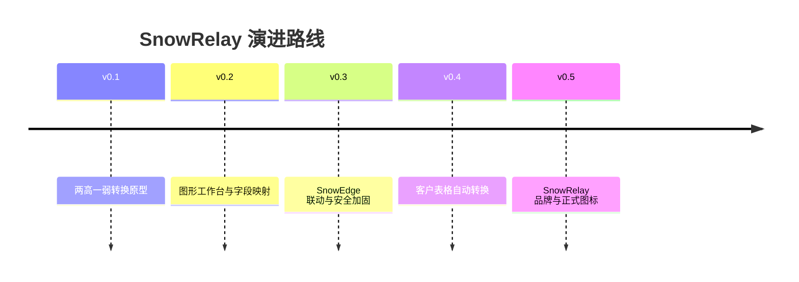

# Changelog

## v0.5.0 — SnowRelay 品牌与图标定稿

- 正式采用 GPL-3.0-or-later 开源许可证，并补充源码与 EXE 发布中的第三方组件声明。
- 数据导入页支持从 Windows 文件资源管理器拖放一个或多个 CSV / Excel 文件，并复用自动识别与转换流程。
- 拖放区域提供进入高亮、格式过滤、重复文件过滤及不支持文件提示。
- 产品正式更名为 **SnowRelay**，突出安全结果转换、标准化和 SnowEdge 联动能力。
- 采用用户确认的雪山与薄荷绿转接箭头图标，并生成无白边多尺寸 Windows ICO。
- 更新窗口标题、输出文件名、Excel 标识、联动包生产者名称和独立 EXE 名称。
- SnowEdge 支持 SnowRelay 新联动包，同时兼容 SnowForge 旧联动包。

## v0.4.1

- Windows 窗口与任务栏只使用多尺寸 ICO，避免 1024 像素 PNG 二次缩放发糊。
- 增加 32、48、64 像素专用 PNG，侧栏直接使用 48 像素品牌图。

## v0.4.0

- 支持客户两高一弱 Excel/CSV 表格一键转换。
- 自动定位前 20 行中的真实表头，兼容顶部标题、单位和日期说明。
- 根据文件名和 Sheet 名识别高危漏洞、高危端口、弱口令原始分类。
- 新增目标 URL 字段，并自动提取域名与端口供 SnowEdge 联动。
- 导入后默认自动转换，仍可关闭后进入字段映射人工校正。

## v0.3.1

- 清理应用图标外围白色残留并重建多尺寸透明 ICO。
- 使用新的发布目录和 Windows 应用标识，避免旧图标缓存。
- 构建完成后自动验证界面启动并清理中间 EXE。

## v0.3.0
- 界面改为与 SnowEdge 同系的浅色靛青紫工作台，统一面板、按钮、状态栏和选中态。
- 侧栏显示正式 SnowForge Logo，并整体提高正文、导航、表格和提示字号。
- 新增 SnowEdge 离线联动包导出，保留来源文件哈希且排除口令明文。
- SnowEdge 被动导入支持联动包本地预览、服务端校验、Scope 过滤、资产/服务/Finding/Evidence 关联。
- 修复“存在任意口令即判定弱口令”的误判，增加凭据待核验状态。
- Excel 导出完整遮盖口令，并防止导入文本触发表格公式。
- Excel 与联动包使用临时文件原子写入；GUI 覆盖已有文件前会明确确认。
- 增加 CSV/Excel 文件大小、总行数、Sheet 数量及异常压缩比限制。

## v0.2.1
- 正式采用用户确认的 SnowForge 软件图标。
- 新增 `assets/brand/snowforge-app.png` 与 Windows `snowforge-app.ico`。
- GUI 窗口标题栏使用 SnowForge 图标。
- PyInstaller 打包脚本同步嵌入 EXE 图标与品牌资源。

## v0.2.0 — SnowForge 品牌重构

- 正式更名为 **SnowForge**，副标题为 **Security Finding Normalization**。
- 全局作者署名统一为 **SnowPeak**。
- 重构为 SnowEdge 风格深色安全工作台界面。
- 新增左侧导航：工作台、数据导入、字段映射、风险结果、导出中心、规则中心。
- 新增 Dashboard：标准化记录、高危漏洞、高危端口、弱口令统计。
- 新增导入数据源的平台识别与字段检测状态展示。
- 新增字段映射检查页，支持手工覆盖自动字段映射并恢复自动识别。
- 将处理流程拆分为“标准化预览”和“结果导出”，界面内可直接查看风险结果。
- 新增风险结果分类切换与双击详情查看。
- 新增规则中心，可查看三类规则数量并打开规则文件维护。
- Excel 汇总页及视觉样式更新为 SnowForge 品牌。
- 默认输出文件更名为 `SnowForge_标准化结果.xlsx`。
- 保留 CSV/XLS/XLSX/XLSM、多文件、多 Sheet、去重、规则分类和口令脱敏能力。

## v0.1.0 — Initial prototype

- 两高一弱结果转换原型。
- 支持 CSV/XLS/XLSX/XLSM 导入。
- 通用字段自动映射与平台特征识别。
- 高危漏洞、高危端口、弱口令分类。
- 标准 Excel 六 Sheet 导出。
- 默认密码字段脱敏。
