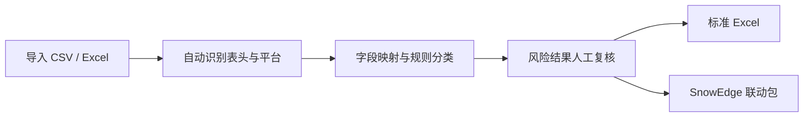
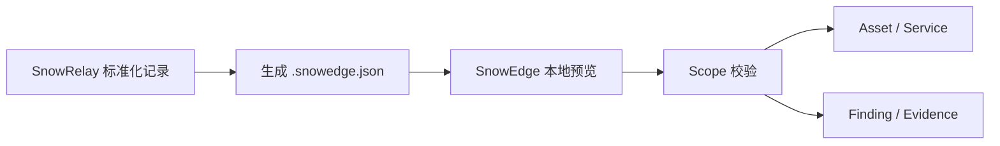

# SnowRelay

<p align="center"></p>

<p align="center"><strong>安全结果标准化 · 两高一弱转换 · SnowEdge 联动</strong></p>

**Security Finding Normalization**  
**Version: v0.5.0**

SnowRelay 是一款用于授权安全检查、漏洞治理与结果交付的数据转换与联动工具。它将不同扫描平台导出的 CSV / XLS / XLSX / XLSM 结果统一映射到 SnowRelay Schema，并自动识别与整理：

- 高危漏洞
- 高危端口
- 弱口令

> 高危端口规则用于标记需要重点核查的开放端口，不应脱离资产暴露面、访问控制和业务必要性直接等价为漏洞。

## 1. v0.5.0 界面

SnowRelay 与 SnowEdge 使用同一套浅色靛青紫视觉语言：明快背景、白色内容面板、清晰的左侧导航和更易读的字号。侧栏与窗口均使用正式 SnowRelay 图标。

主要页面：

1. **工作台**：查看标准化记录、高危漏洞、高危端口、弱口令统计和数据来源。
2. **数据导入**：将一个或多个客户 CSV / Excel 两高一弱表格直接拖入窗口，或通过按钮选择；自动识别标题行、Sheet 分类和字段，并默认直接转换。
3. **字段映射**：查看自动映射结果，针对未识别/误识别字段进行手工纠正。
4. **风险结果**：直接切换查看全部、高危漏洞、高危端口、弱口令、未识别记录；双击查看详情。
5. **导出与联动**：生成 SnowRelay 标准 Excel，或生成 `.snowedge.json` 联动包交接到 SnowEdge。
6. **规则中心**：查看并维护高危漏洞、高危端口、弱口令规则文件。

## 2. 支持的数据格式

- CSV
- XLS
- XLSX
- XLSM
- Excel 多 Sheet
- 多文件同时导入
- 从 Windows 文件资源管理器拖放一个或多个文件
- 客户表格顶部标题、单位、日期等说明行
- 按“高危漏洞 / 高危端口 / 弱口令”命名的多 Sheet 工作簿
- URL 自动提取域名与端口

当前使用通用字段检测，同时内置 Nessus、Greenbone/OpenVAS、Nuclei、绿盟、奇安信、启明星辰等平台特征识别基础。

## 3. SnowRelay Schema

核心字段包括：

`asset_ip`、`hostname`、`port`、`protocol`、`service`、`severity`、`cvss`、`vuln_name`、`cve`、`cnvd`、`cnnvd`、`username`、`password`、`description`、`evidence`、`solution`。

工具还会补充来源平台、来源文件、来源 Sheet、原始行号、两高一弱分类和命中原因。

口令字段存在只表示“发现凭据（待核验）”；只有命中弱口令关键词或字典时才标记为“弱口令”。

## 4. 快速开始（Windows）

安装 Python 3.10+ 后：

```bat
install.bat
start.bat
```

或者：

```bash
pip install -r requirements.txt
python main.py --gui
```

程序内推荐流程：



## 5. 命令行模式

```bash
python main.py samples/sample_vulns.csv -o SnowRelay_标准化结果.xlsx
```

同时生成 SnowEdge 联动包：

```bash
python main.py samples/sample_vulns.csv -o result.xlsx --snowedge-output result.snowedge.json
```

不脱敏密码：

```bash
python main.py samples/sample_vulns.csv -o result.xlsx --no-mask
```

## 6. Excel 输出

默认输出 6 个 Sheet：

- 汇总
- 高危漏洞
- 高危端口
- 弱口令
- 未识别数据
- 全部标准化数据

Excel 汇总页会写入产品名 **SnowRelay** 和能力说明。所有外部文本在写入工作簿前都会处理为普通文本，避免被表格软件当作公式执行；口令默认完整遮盖。

## 7. SnowEdge 联动



SnowRelay 的“导出与联动”页可以生成 `.snowedge.json`。联动包包含标准化资产、服务、风险、Evidence 和原始文件 SHA-256，不包含口令明文。

在 SnowEdge 中打开项目的“导入数据”，选择“SnowRelay → SnowEdge 联动包”。页面会先在本地显示记录、资产、Finding 和 Evidence 数量，确认格式后再提交。SnowEdge 服务端会再次校验格式、拒绝口令明文，并按项目 Scope 过滤后写入现有资产、服务、候选 Finding 和 Evidence 数据链。

## 8. 规则维护

目录：`rules/`

- `high_vulnerabilities.txt`：高危 CVE / 漏洞规则
- `high_ports.txt`：需要重点核查的高危端口
- `weak_passwords.txt`：组织批准使用的弱口令检查字典

每行一条，`#` 开头表示注释。

## 9. 项目结构

```text
SnowRelay/
├─ app/            GUI 与处理流水线
├─ adapters/       文件读取、字段映射、平台识别
├─ models/         SnowRelay Schema
├─ processors/     数据标准化与规则引擎
├─ exporters/      Excel 导出
├─ rules/          两高一弱规则库
├─ samples/        示例数据与示例结果
├─ tests/          自动化测试
├─ main.py
├─ start.bat
└─ build_exe.bat
```

## 10. 打包 EXE

Windows 下运行：

```bat
build_exe.bat
```

生成独立的 `SnowRelay.exe`。

## 11. 安全边界

SnowRelay 不主动扫描目标，不实施漏洞利用。它用于处理已有的、经授权获取的扫描结果与治理数据。单个输入文件限制为 50 MB、总记录限制为 200,000 条，并检查异常工作簿压缩比。弱口令字段在 Excel 中默认完整遮盖，在 SnowEdge 联动包中始终排除。

## 12. 授权说明

Copyright © 2026 SnowPeak。当前尚未指定开源许可证；公开源码不等于授予复制、修改、分发或商业使用许可。第三方依赖遵循各自许可证。

---

**SnowRelay — Security Finding Relay & Normalization**


## 品牌资源

软件正式图标位于 `assets/brand/snowrelay-app.png`，Windows 打包图标位于 `assets/brand/snowrelay.ico`。
